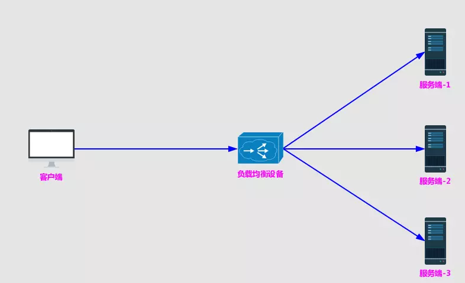
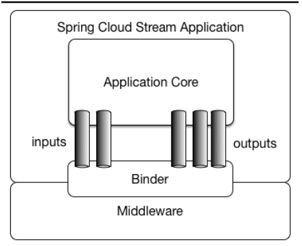

## Spring微服务实战学习笔记 - 第一章 欢迎迈入云世界，Spring
### Netflix Hystrix - 服务器的弹性容错
1、Spring Cloud 与 Netflix 的开源项目进行了大量的整合。

2、在分布式环境中，许多服务依赖项中的一些必然会失败。Hystrix是一个库，通过添加延迟容忍和容错逻辑，帮助你控制这些分布式服务之间的交互。Hystrix通过隔离服务之间的访问点、停止级联失败和提供回退选项来实现这一点，所有这些都可以提高系统的整体弹性。
([什么是Hystrix？](https://www.cnblogs.com/cjsblog/p/9391819.html))

### Netflix Ribbon - 客户端对服务器的负载均衡
1、Spring Cloud Ribbon是一个基于HTTP和TCP的客户端负载均衡工具，它基于Netflix Ribbon实现。通过Spring Cloud的封装，可以让我们轻松地将面向服务的REST模版请求自动转换成客户端负载均衡的服务调用。Spring Cloud Ribbon虽然只是一个工具类框架，它不像服务注册中心、配置中心、API网关那样需要独立部署，但是它几乎存在于每一个Spring Cloud构建的微服务和基础设施中。因为微服务间的调用，API网关的请求转发等内容，实际上都是通过Ribbon来实现的。([Ribbon详解](https://www.jianshu.com/p/1bd66db5dc46))

2、[什么是负载均衡？](https://www.jianshu.com/p/1bd66db5dc46)

负载均衡在系统架构中是一个非常重要，并且是不得不去实施的内容。因为负载均衡是对系统的高可用、网络压力的缓解和处理能力扩容的重要手段之一。我们通常所说的负载均衡都指的是服务端负载均衡，其中分为硬件负载均衡和软件负载均衡。硬件负载均衡主要通过在服务器节点之间按照专门用于负载均衡的设备，比如F5等；而软件负载均衡则是通过在服务器上安装一些用于负载均衡功能或模块等软件来完成请求分发工作，比如Nginx等。不论采用硬件负载均衡还是软件负载均衡，只要是服务端都能以类似下图的架构方式构建起来：

    
     
    负载均衡架构图

### Netflix Zuul - 服务路由
1、在微服务框架中，每个对外服务都是独立部署的，对外的api或者服务地址都不是不尽相同的。对于内部而言，很简单，通过注册中心自动感知即可。但我们大部分情况下，服务都是提供给外部系统进行调用的，不可能同享一个注册中心。同时一般上内部的微服务都是在内网的，和外界是不连通的。而且，就算我们每个微服务对外开放，对于调用者而言，调用不同的服务的地址或者参数也是不尽相同的，这样就会造成消费者客户端的复杂性，同时想想，可能微服务可能是不同的技术栈实现的，有的是http、rpc或者websocket等等，也会进一步加大客户端的调用难度。所以，一般上都有会有个api网关，根据请求的url不同，路由到不同的服务上去，同时入口统一了，还能进行统一的身份鉴权、日志记录、分流等操作。（[路由网关(Zuul)的使用](https://blog.lqdev.cn/2018/10/14/SpringCloud/chapter-nine)）

### Spring Cloud Stream 构建消息驱动

    
     
    Spring Cloud Stream架构图(官方)

1、应用程序通过 inputs 或者 outputs 来与 Spring Cloud Stream 中binder 交互，通过我们配置来 binding ，而 Spring Cloud Stream 的 binder 负责与消息中间件交互。所以，我们只需要搞清楚如何与 Spring Cloud Stream 交互就可以方便使用消息驱动的方式。（[Stream消息驱动](https://www.cnblogs.com/huangjuncong/p/9102843.html)）

2、 为什么需要SpringCloud Stream消息驱动呢？

比方说我们用到了RabbitMQ和Kafka，由于这两个消息中间件的架构上的不同，像RabbitMQ有exchange，kafka有Topic，partitions分区，这些中间件的差异性导致我们实际项目开发给我们造成了一定的困扰，我们如果用了两个消息队列的其中一种。后面的业务需求，我想往另外一种消息队列进行迁移，这时候无疑就是一个灾难性的，一大堆东西都要重新推倒重新做，因为它跟我们的系统耦合了，这时候Spring Cloud Stream给我们提供了一种解耦合的方式。

### Spring Cloud Sleuth - 分布式链路跟踪
1、微服务架构是一个分布式架构，它按业务划分服务单元，一个分布式系统往往有很多个服务单元。由于服务单元数量众多，业务的复杂性，如果出现了错误和异常，很难去定位。主要体现在，一个请求可能需要调用很多个服务，而内部服务的调用复杂性，决定了问题难以定位。所以微服务架构中，必须实现分布式链路追踪，去跟进一个请求到底有哪些服务参与，参与的顺序又是怎样的，从而达到每个请求的步骤清晰可见，出了问题，很快定位。([Spring Cloud Sleuth超详细实战](https://www.cnblogs.com/xingzc/p/9413860.html))

### Spring Cloud Security - 验证和授权
Spring Cloud Security 是一个验证和授权框架，可以控制哪些人可以访问服务，以及他们可以用服务做什么。Spring Cloud Security 是基于令牌的，允许服务通过验证服务器发出的令牌彼此进行通信。接收调用的每个服务可以检查HTTP调用中提供的令牌，以确认用户的身份以及用户对该服务的访问权限。
